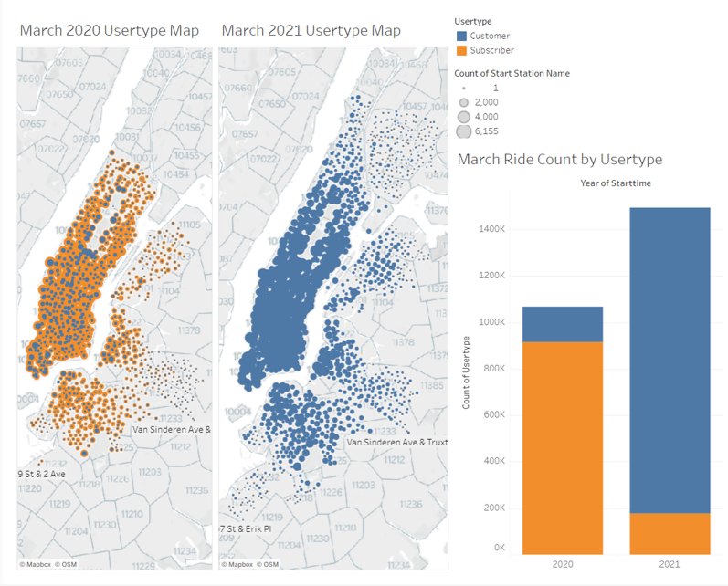
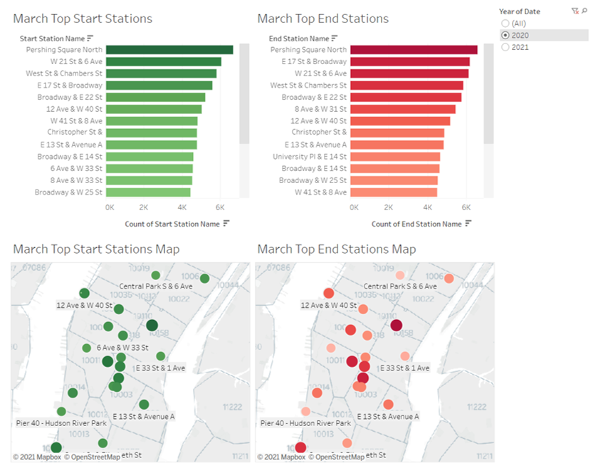
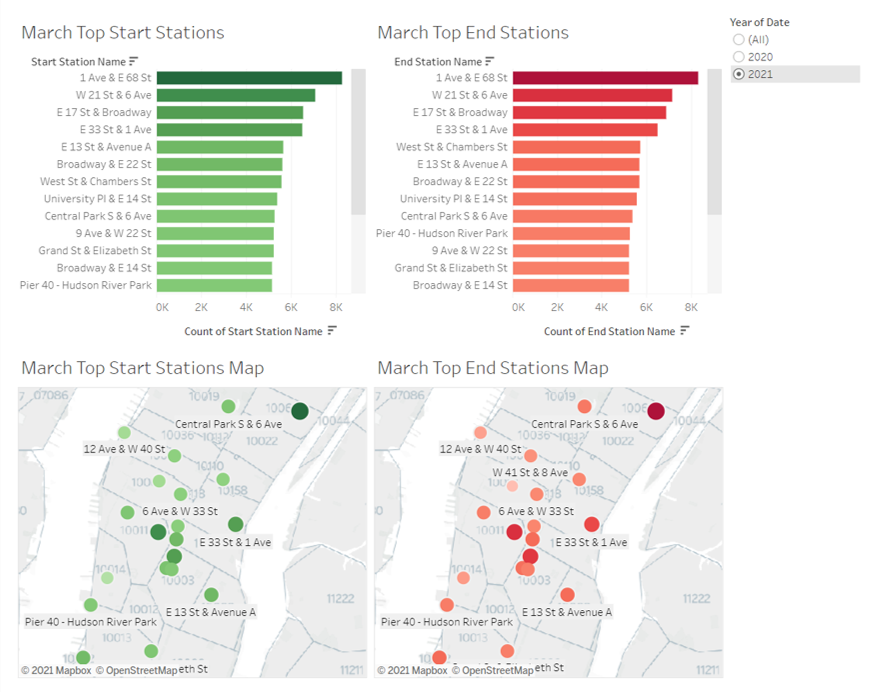

# Citi Bike NYC Analysis

NYC has one of the largest bike sharing programs in the world. Citibike, provided by Lyft, shares monthly ridership data with the public [here](https://www.citibikenyc.com/system-data). This report outlines an analysis of ridership durring the COVID-19 pandemic using Tableau.

## Sources: 
### Data:
[https://www.citibikenyc.com/system-data](https://www.citibikenyc.com/system-data)

### News:
[https://www.citibikenyc.com/blog/major-citi-bike-expansion-map-revealed#:~:text=City%20releases%20boundaries%20of%20Citi,Manhattan%20in%20the%20next%20year.](https://www.citibikenyc.com/blog/major-citi-bike-expansion-map-revealed#:~:text=City%20releases%20boundaries%20of%20Citi,Manhattan%20in%20the%20next%20year.)

[https://www.nydailynews.com/new-york/ny-citi-bike-manhattan-bike-sharing-20210407-fxt2jsgokfhkbldon4tvbkte7u-story.html](https://www.nydailynews.com/new-york/ny-citi-bike-manhattan-bike-sharing-20210407-fxt2jsgokfhkbldon4tvbkte7u-story.html)

[https://nyc.streetsblog.org/2021/03/25/exclusive-bill-would-allow-public-to-weigh-in-on-citi-bike-fare-hikes/#:~:text=The%20bike%2Dshare%20system%20has,(a%20six%20percent%20increase)](https://nyc.streetsblog.org/2021/03/25/exclusive-bill-would-allow-public-to-weigh-in-on-citi-bike-fare-hikes/#:~:text=The%20bike%2Dshare%20system%20has,(a%20six%20percent%20increase))

## Analysis

The interactive Tableau story is publicly available [here](https://public.tableau.com/profile/hope.neely#!/vizhome/Citi_Bike_Analysis_16203403215890/CitibikeAnalysis).

### Ridership Demand and Supply
The below dashboard shows Citi Bike's footprint grew substanially from March 2020 to March 2021. This growth is part of a planned expansion outlined in 2019. It's not surpising that the number of rides increased by 39%. Interstingly, usertype has shifted dramaticly from anual subcriber to per-use customer from March 2020 to March 2021. Judging from the news articles linked above, it seems the combination of increased demand and a price increase has pushed costomers to make the shift from subscriber to per-use customer. Demand for bikesharing durring the COVID-19 pandemic increased as commuters were less willing to ride public transit in enclosed areas with other passengers. The open air bike ride seemed to feel like a safer option for many. This lead to bike shortages that left riders without bikes for commutes when needed. Comined with a price increase, riders opted to only pay for bikesharing when they had access to it. The Citibike expansion announced in 2019 already planed to more than double their bike fleet to 40,000 by 2023. If this demand continues over time usertype may shift back to a subsciber model as bikes are more conistiantly available to commuters.

### Ridership Use Patterns
The dashboard below shows top starting and ending stations in March 2020. Pershing Square North was the top bikes sharing start and end location in the city during this time period. This makes sense it is next to Grand Central Terminal which is a transportation hub in Midtown Manhattan with a large commercial presence. It's easy to get to from anywhere with near by places to visit and work. 

The below dashboard shows top starting and ending stations in March 2021. In contrast to the year before, 1 Ave & E. 68th St. was the top bike sharing start and end location in the city. It seems travel has shifted from the commerial Midtown Manhattan to the Upper East Side. This area is more residential with universities and the proximity to central park. It seems riders may not be commuting to commersial areas at the same rate as the year before. The COVID-19 pandemic was just becoming a large problem for New Yorkers in March 2020. Habits may have shifted already at that point, but it took time to make the decision to close non-essential business and for information about safer habbits to become available. In March 2021, some workers may still working from home or in some sort of hibrid model. Social meetups have shifted to outdoors with fewer public indoor interactions like shopping and eating out. The univeristies may still have more activity with a younger crowd being less vunerable to servire illness from COVID-19. 

In conclusion, I'm rooting for Citi Bike's success! It will be interesting to watch consumer demand in the coming years as Citi Bike coninues to grow. Have habits changed for good? Will New York City go from being "the city that never sleeps" to be known for bikeridership and healthy living? Mabye. It's definitly a boon for public health and sustainablitiy after a rough year. 

